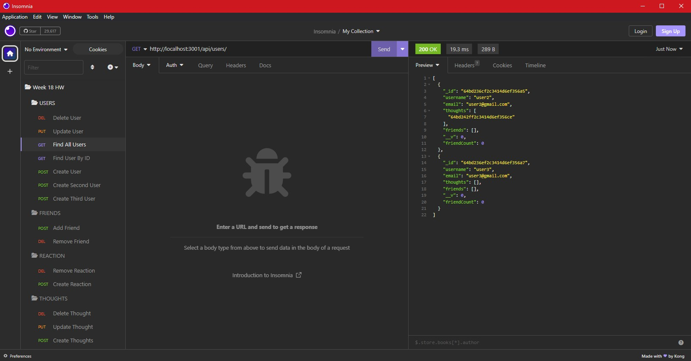
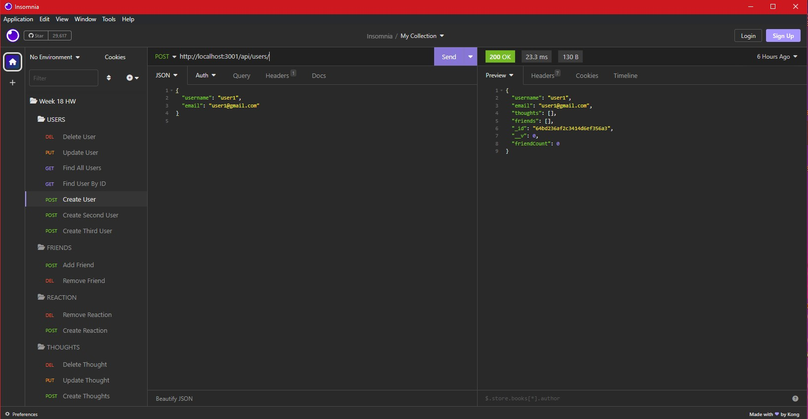
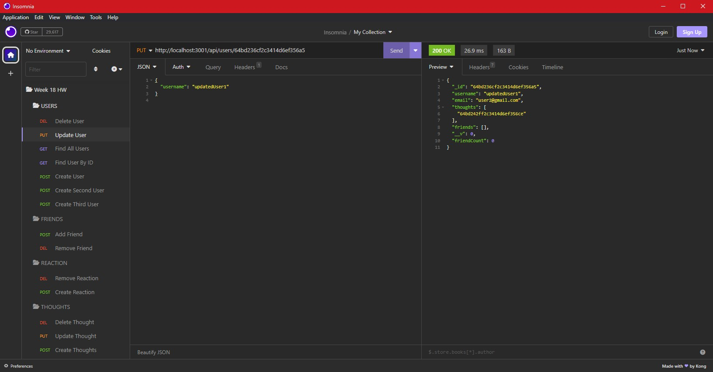
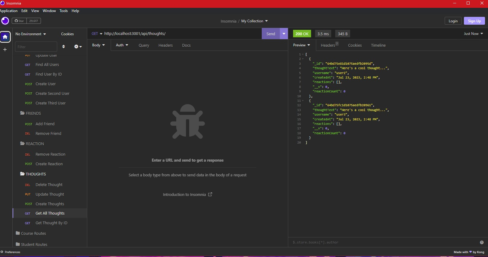
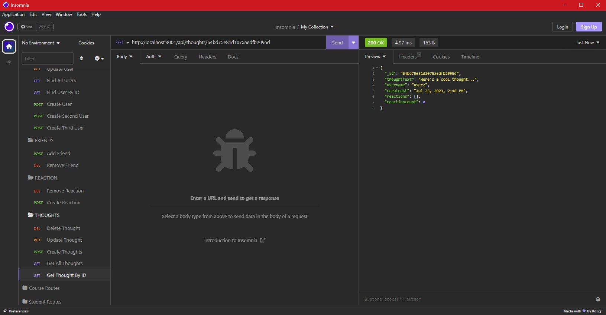
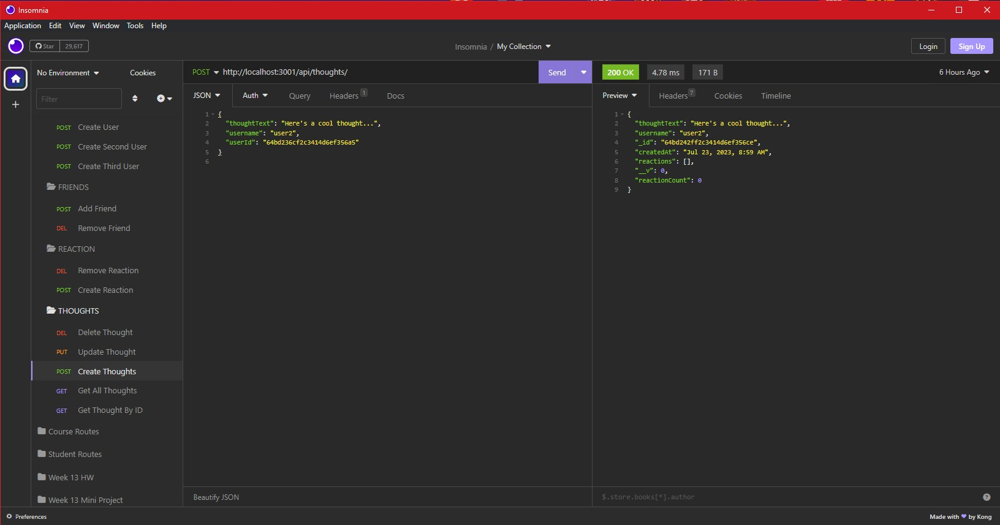

# Social Network API

## Description

In this project, I developed a robust API for a social network web application that enables users to effortlessly share their thoughts, react to their friends' thoughts, and manage their friend list. To achieve this, I utilized technologies, such as Express.js for efficient routing, MongoDB, a document-based, distributed NoSQL database, and the Mongoose ODM for seamless interaction with the database.

To gain valuable insights and visualize the MongoDB data, I make use of MongoDB Compass, a powerful GUI tool that facilitated the exploration of data. Additionally, to thoroughly test and interact with the various API endpoints, I employed Insomnia Core, a versatile tool that allowed me to perform tests on CRUD operations for users and thoughts, as well as POST and DELETE actions for friends and reactions.

Through the completion of this project, I acquired a wealth of new knowledge and skills. Notably, I became adept at executing CRUD queries using Mongoose, implementing Mongoose virtual properties to generate computed attributes, creating effective models to map and enhance MongoDB documents' functionality, defining well-structured database schemas with Mongoose, efficiently updating and deleting documents within MongoDB, and skillfully handling the insertion, retrieval, and return of data stored in the MongoDB database.

Overall, this project has been an enlightening experience that has significantly expanded my expertise in API development, database management, and modern web application technologies.

## Table of Contents
1. [Installation](#installation)
2. [Usage](#usage)
3. [Credits](#credits)
4. [Questions](#questions)  
5. [License](#license)

## Installation
- Download and install the Node.js LTS version from [Node.js](https://nodejs.org/en).
- Clone the repo using:

        git clone git@github.com:Dinh282/social-network-API.git

 - Or download the code from https://github.com/Dinh282/e-commerce-back-end.git and
open it with VS Code.       
- Make sure you are in the root path of the project folder and then install dependencies for the project with:

        npm i

- You would also need to download MongoDB and start your database. The article at https://coding-boot-camp.github.io/full-stack/mongodb/how-to-install-mongodb can guide you through the download and installation.
- You also need a REST Client tool to test the APIs. You can download and use Insomnia for this at: https://insomnia.rest/download. 

## Usage
 - Once you have everything installed and set up, change your current working directory to the root of the project folder.
 - Run the application with the following command:

        npm start

- You should see "Connected successfully to MongoDB. API server listening at http://localhost:3001!" in the terminal. 
- You can test the APIs with Insomnia by making GET, POST, PUT, and DEL requests for different models at the routes defined in the routes folder.
- For your convenience, you can import the Insomnia_Routes.json file into Insomnia and use those predefined routes. 

- Alternatively, you can view the demo video. 

https://github.com/Dinh282/social-network-API/assets/112836220/1271c214-1773-409b-8ffc-2582af36f4a5

The following are screenshots of some of the routes tested with Insomnia:

GET Route For Finding All Users:

POST Route For Creating A User:

PUT Route For Updating A User:

GET Route For Finding ALL Thoughts:

GET Route For Finding A Thought By ID:

POST Route For Creating A Thought:

## Credits:
1. https://masteringjs.io/tutorials/mongoose/unique#:~:text=For%20example%2C%20below%20is%20how,('User'%2C%20userSchema)%3B (Help with Mongoose options)

2. https://mongoosejs.com/docs/schematypes.html#strings (Help with mongoose)

3. https://www.youtube.com/watch?v=DZBGEVgL2eE (Help with understanding Mongoose)

4. https://www.youtube.com/watch?v=ofme2o29ngU (Help with MongoDB)

5. https://www.youtube.com/watch?v=fgTGADljAeg (Help with REST API)

6. Instructor, TAs, and classmates.

## Questions
Feel free to contact me at nguyen_dinh282@yahoo.com for additional information.  
Also, check out my other projects on [GitHub](https://github.com/Dinh282)

## License

Please refer to the LICENSE section in the repository.

---
